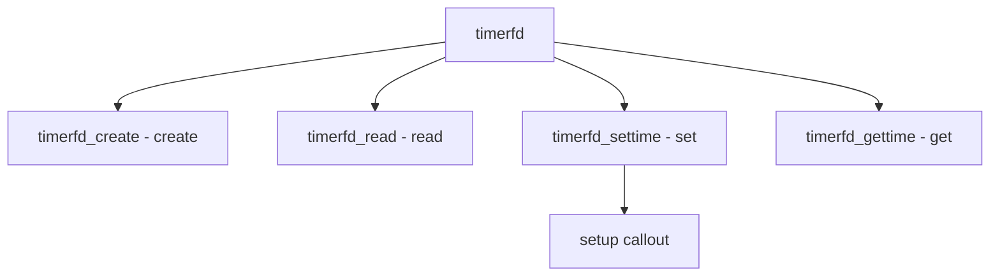

# Component: sys_timerfd.c

**Path:** `sys/kern/sys_timerfd.c`
**Type:** File
**Maps to:** `.discovery/sys/kern/sys_timerfd.md`

## Purpose

Timerfd - Linux-compatible timer file descriptor. Provides timer notifications through file descriptor API.

## Structure



## Key Functions

| Function | Purpose | Signature |
|----------|---------|-----------|
| `timerfd_create` | Create | `int timerfd_create(int clockid, int flags)` |
| `timerfd_read` | Read | `int timerfd_read(struct file *fp, struct uio *uio, int flags)` |
| `timerfd_settime` | Set time | `int timerfd_settime(struct thread *td, struct timerfd_set_args *uap)` |
| `timerfd_gettime` | Get time | `int timerfd_gettime(struct thread *td, struct timerfd_gettime_args *uap)` |

## Flags

| Flag | Description |
|------|-------------|
| `TFD_CLOEXEC` | Close on exec |
| `TFD_NONBLOCK` | Non-blocking |
| `TFD_CLOEXEC` | Timer CLOEXEC |

## Clock IDs

| ID | Description |
|----|-------------|
| `CLOCK_REALTIME` | Real time |
| `CLOCK_MONOTONIC` | Monotonic |

## Structure

```c
struct timerfd {
    struct callout tfd_callout;   // Callout
    struct timespec tfd_ival;     // Interval
    struct timespec tfd_value;    // Value
    int tfd_clockid;            // Clock
};
```

## Use Cases

| Use | Description |
|-----|-------------|
| `timer` | Timer notification |
| `async` | Async I/O |

## Includes

- `sys/timerfd.h` - Timerfd definitions