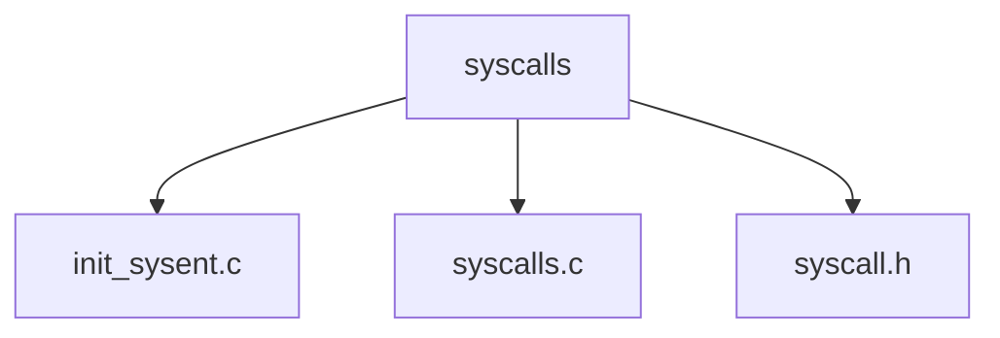

# Component: syscalls.master

**Path:** `sys/kern/syscalls.master`
**Type:** File (master)
**Maps to:** `.discovery/sys/kern/syscalls.md`

## Purpose

System call master - master definition file for all system calls. Processed to generate init_sysent.c, syscalls.c, and syscall.h.

## Structure

## Columns

| Column | Description |
|--------|-------------|
| `number` | Syscall number |
| `audit` | Audit event |
| `type` | Type (STD, COMPAT, etc.) |
| `name` | Syscall name |

## Types

| Type | Description |
|------|-------------|
| `STD` | Standard |
| `COMPAT` | Compatibility |
| `OBSOL` | Obsolete |
| `RESERVED` | Reserved |
| `UNIMPL` | Unimplemented |
| `SYSMUX` | Multiplexer |
| `NOSTD` | No std |

## Note

- **Master file** - do not edit directly
- Processed by build system
- Generates syscall tables