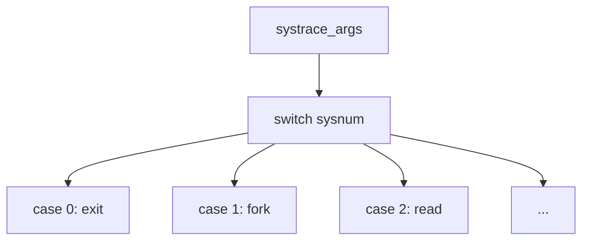

# Component: systrace_args.c

**Path:** `sys/kern/systrace_args.c`
**Type:** File (auto-generated)
**Maps to:** `.discovery/sys/kern/systrace_args.md`

## Purpose

DTrace syscall provider - converts system call arguments to DTrace register array format. **Auto-generated file.**

## Structure

## Key Functions

| Function | Purpose | Signature |
|----------|---------|-----------|
| `systrace_args` | Convert args | `void systrace_args(int sysnum, void *params, uint64_t *uarg, int *n_args)` |

## Usage

| Use | Description |
|-----|-------------|
| `DTrace` | Syscall provider |
| `args` | Arg conversion |

## Note

- **Auto-generated** - do not edit manually
- Maps syscall numbers to argument arrays
- Used by DTrace for syscall tracing