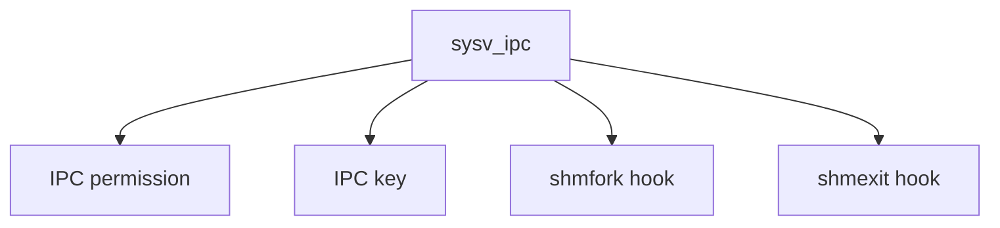

# Component: sysv_ipc.c

**Path:** `sys/kern/sysv_ipc.c`
**Type:** File
**Maps to:** `.discovery/sys/kern/sysv_ipc.md`

## Purpose

System V IPC base - common infrastructure for semaphores, shared memory, and message queues.

## Structure

## Key Functions

| Function | Purpose | Signature |
|----------|---------|-----------|
| `shmfork` | Shmem fork | `void shmfork(struct proc *p1, struct proc *p2)` |
| `shmexit` | Shmem exit | `void shmexit(struct vmspace *vm)` |
| `ipcperm` | Permission | `int ipcperm(struct ucred *cr, struct ipc_perm *perm, int mode)` |

## IPC Components

| Component | Description |
|-----------|-------------|
| `msg` | Message queues |
| `sem` | Semaphores |
| `shm` | Shared memory |

## Permission Modes

| Mode | Description |
|------|-------------|
| `IPC_R` | Read |
| `IPC_W` | Write |
| `IPC_M` | Manage |

## Use Cases

| Use | Description |
|-----|-------------|
| `ipc` | System V IPC |

## Includes

- `sys/ipc.h` - IPC definitions
- `sys/sem.h` - Semaphore
- `sys/shm.h` - Shared memory