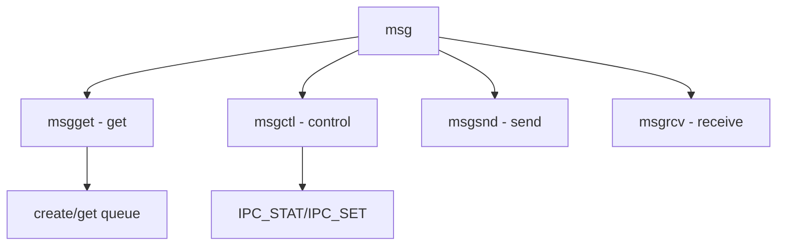

# Component: sysv_msg.c

**Path:** `sys/kern/sysv_msg.c`
**Type:** File
**Maps to:** `.discovery/sys/kern/sysv_msg.md`

## Purpose

System V message queues - SVID message primitive implementation.

## Structure



## Key Functions

| Function | Purpose | Signature |
|----------|---------|-----------|
| `msgget` | Get | `int msgget(key_t key, int msgflg)` |
| `msgctl` | Control | `int msgctl(int msqid, int cmd, struct msqid_ds *buf)` |
| `msgsnd` | Send | `int msgsnd(int msqid, const void *msgp, size_t msgsz, int msgflg)` |
| `msgrcv` | Receive | `int msgrcv(int msqid, void *msgp, size_t msgsz, long msgtyp, int msgflg)` |

## Commands

| Cmd | Description |
|-----|-------------|
| `IPC_STAT` | Get stats |
| `IPC_SET` | Set stats |
| `IPC_RMID` | Remove |

## Structure

```c
struct msqid_ds {
    struct ipc_perm msg_perm;  // Permission
    struct msg *msg_first;     // First message
    struct msg *msg_last;      // Last message
    // ...
};
```

## Use Cases

| Use | Description |
|-----|-------------|
| `ipc` | Message passing |

## Includes

- `sys/msg.h` - Message definitions