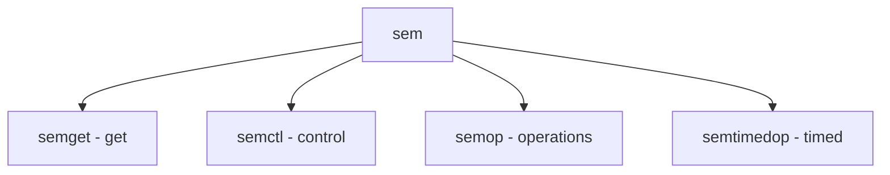

# Component: sysv_sem.c

**Path:** `sys/kern/sysv_sem.c`
**Type:** File
**Maps to:** `.discovery/sys/kern/sysv_sem.md`

## Purpose

System V semaphores - SVID semaphore primitive implementation.

## Structure



## Key Functions

| Function | Purpose | Signature |
|----------|---------|-----------|
| `semget` | Get | `int semget(key_t key, int nsems, int semflg)` |
| `semctl` | Control | `int semctl(int semid, int semnum, int cmd, ...)` |
| `semop` | Operate | `int semop(int semid, struct sembuf *sops, size_t nsops)` |
| `semtimedop` | Timed op | `int semtimedop(int semid, struct sembuf *sops, size_t nsops, const struct timespec *timeout)` |

## Commands

| Cmd | Description |
|-----|-------------|
| `GETVAL` | Get value |
| `SETVAL` | Set value |
| `GETNCNT` | Count |
| `GETPID` | PID |
| `IPC_RMID` | Remove |

## Structure

```c
struct sembuf {
    ushort_t sem_num;  // Semaphore number
    short_t  sem_op;   // Operation
    short_t  sem_flg;  // Flags
};
```

## Use Cases

| Use | Description |
|-----|-------------|
| `sync` | Synchronization |

## Includes

- `sys/sem.h` - Semaphore definitions