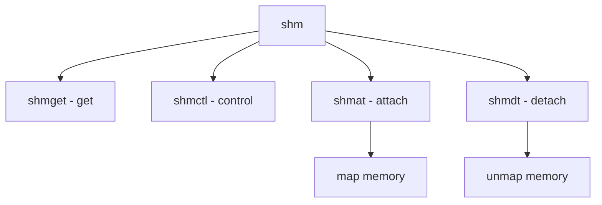

# Component: sysv_shm.c

**Path:** `sys/kern/sysv_shm.c`
**Type:** File
**Maps to:** `.discovery/sys/kern/sysv_shm.md`

## Purpose

System V shared memory - SVID shared memory primitive implementation.

## Structure



## Key Functions

| Function | Purpose | Signature |
|----------|---------|-----------|
| `shmget` | Get | `int shmget(key_t key, size_t size, int shmflg)` |
| `shmctl` | Control | `int shmctl(int shmid, int cmd, struct shmid_ds *buf)` |
| `shmat` | Attach | `int shmat(int shmid, const void *shmaddr, int shmflg)` |
| `shmdt` | Detach | `int shmdt(const void *shmaddr)` |

## Commands

| Cmd | Description |
|-----|-------------|
| `IPC_STAT` | Get stats |
| `IPC_SET` | Set stats |
| `IPC_RMID` | Remove |
| `SHM_LOCK` | Lock |
| `SHM_UNLOCK` | Unlock |

## Structure

```c
struct shmid_ds {
    struct ipc_perm shm_perm;   // Permission
    size_t shm_segsz;          // Size
    struct vmspace *shm_internal; // Vmspace
    // ...
};
```

## Use Cases

| Use | Description |
|-----|-------------|
| `memory` | Shared memory |
| `ipc` | IPC mechanism |

## Includes

- `sys/shm.h` - Shared memory definitions