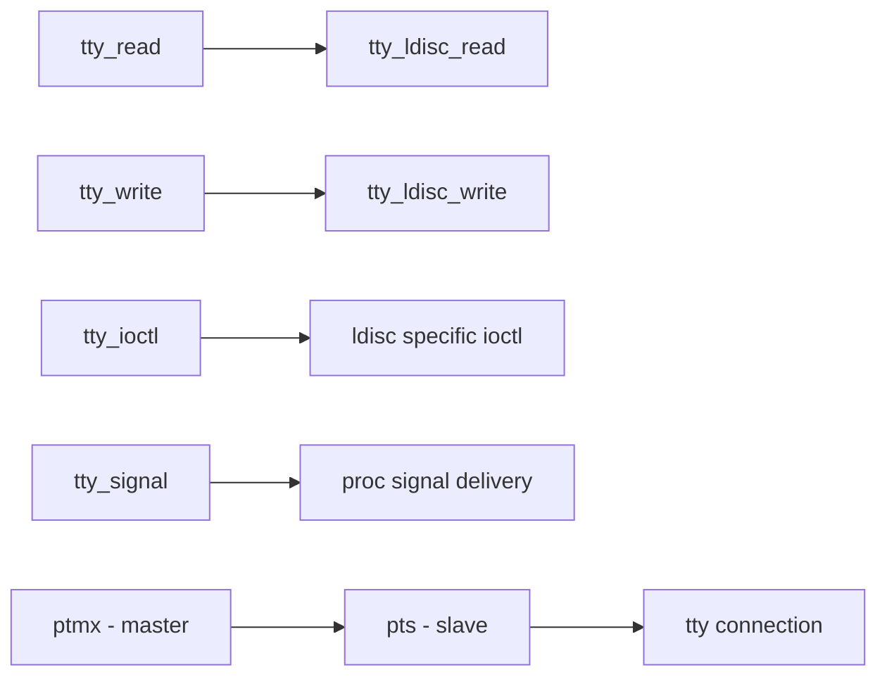

# Component: tty.c

**Path:** `sys/kern/tty.c`
**Type:** File
**Maps to:** `.discovery/sys/kern/tty.md`

## Purpose

TTY (terminal) subsystem core - implements terminal device handling, line discipline, and I/O multiplexing. Provides terminal control and line discipline infrastructure.

## Structure

## Key Functions

| Function | Purpose | Signature |
|----------|---------|-----------|
| `ttydevsw` | TTY device switch | `struct cdevsw *ttydevsw` |
| `tty_create` | Create tty device | `struct tty *tty_create(struct ttydevsw *tsw, void *softc)` |
| `tty_destroy` | Destroy tty | `void tty_destroy(struct tty *tp)` |
| `tty_makedev` | Make device node | `void tty_makedev(struct tty *tp, const char *name)` |
| `tty_l_close` | Close last ref | `int tty_l_close(struct tty *tp, struct tty *tp, int flags)` |
| `tty_m_savec` | Save chars | `void tty_m_savec(struct tty *tp)` |
| `tty_nldata` | Line discipline data | `int tty_nldata(struct tty *tp, struct tty_nldata *tnd)` |

## Line Discipline

| Ldisc | Name | Description |
|-------|------|-------------|
| `TTYDISC` | TERMIO | Standard terminal |
| `SLIPDISC` | SLIP | Serial IP |
| `PPPDISC` | PPP | Point-to-Point Protocol |
| `NETDISCDISC` | NetDisc | Network discard |

## TTY Flags

| Flag | Description |
|------|-------------|
| `TF_LITERAL` | 8-bit clean mode |
| `TF_GOT十三` | Got CR |
| `TF_LTZERO` | Line terminated with NUL |

## Includes

- `sys/tty.h` - TTY definitions
- `sys/ttydisc.h` - Line discipline
- `sys/serial.h` - Serial port

## Depends On

- `tty_pts.c` for pseudo-TTY
- `tty_ttydisc.c` for line discipline
- `serial.c` for hardware serial