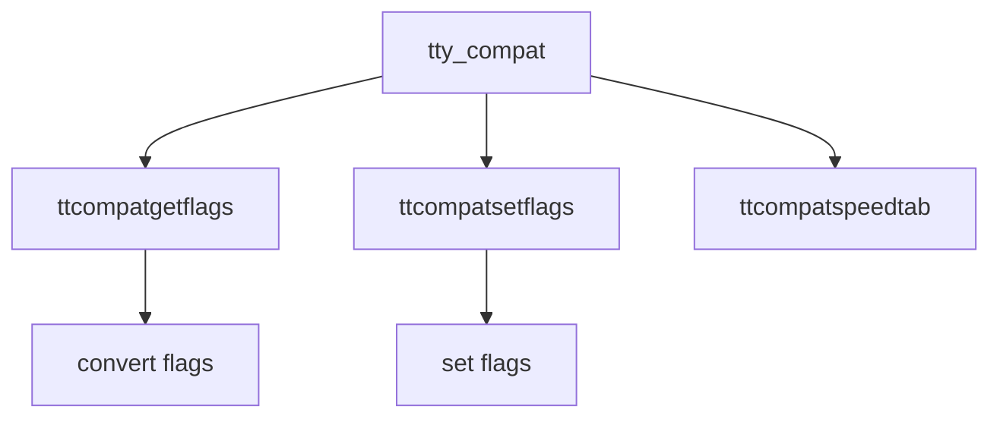

# Component: tty_compat.c

**Path:** `sys/kern/tty_compat.c`
**Type:** File
**Maps to:** `.discovery/sys/kern/tty_compat.md`

## Purpose

TTY compatibility layer - mapping routines for old line discipline (BSD 4.x compatibility).

## Structure



## Key Functions

| Function | Purpose | Signature |
|----------|---------|-----------|
| `ttcompatgetflags` | Get flags | `static int ttcompatgetflags(struct tty *tp)` |
| `ttcompatsetflags` | Set flags | `static void ttcompatsetflags(struct tty *tp, struct termios *t)` |
| `ttcompatspeedtab` | Speed table | `static int ttcompatspeedtab(int speed, struct speedtab *table)` |

## Speed Table

```c
struct speedtab {
    int sp_speed;  // Speed
    int sp_code;   // Code
};
```

## Compatibility

| Item | Description |
|------|-------------|
| `TIOCGETP` | Get params |
| `TIOCSETP` | Set params |
| `TIOCSETN` | Set noflush |

## Use Cases

| Use | Description |
|-----|-------------|
| `compat` | Old tty compat |

## Includes

- `sys/tty.h` - TTY definitions
- `sys/ioctl_compat.h` - Old ioctls