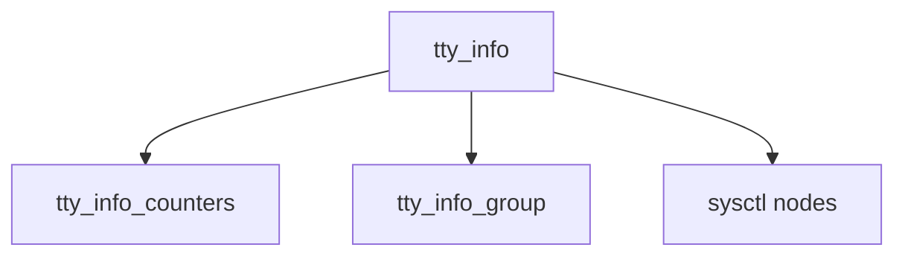

# Component: tty_info.c

**Path:** `sys/kern/tty_info.c`
**Type:** File
**Maps to:** `.discovery/sys/kern/tty_info.md`

## Purpose

TTY information - sysctl nodes and statistics for TTY devices.

## Structure

## Key Functions

| Function | Purpose | Signature |
|----------|---------|-----------|
| `tty_info_counters` | Counters | `static int tty_info_counters(struct sysctl_oid *oid, void *arg1, int arg2, struct sysctl_req *req)` |
| `tty_info_group` | Group | `static int tty_info_group(struct sysctl_oid *oid, void *arg1, int arg2, struct sysctl_req *req)` |

## Sysctl Nodes

| Node | Description |
|------|-------------|
| `kern.tty` | TTY info |
| `kern.tty_counters` | Counters |

## Use Cases

| Use | Description |
|-----|-------------|
| `info` | TTY info |
| `stats` | Statistics |

## Includes

- `sys/tty.h` - TTY definitions
- `sys/sysctl.h` - Sysctl definitions