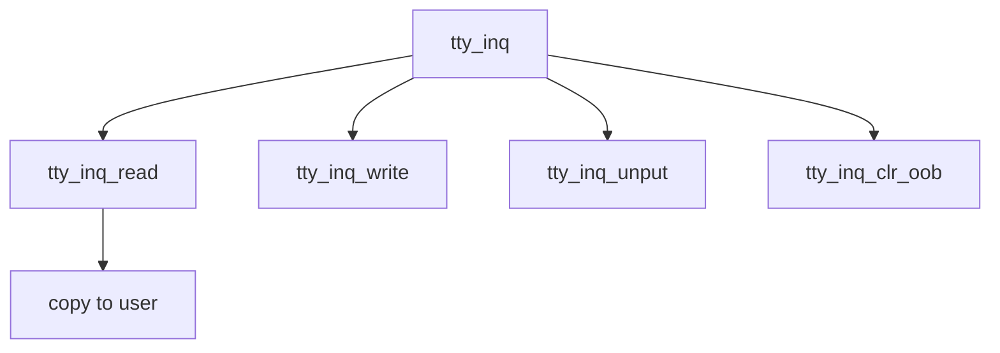

# Component: tty_inq.c

**Path:** `sys/kern/tty_inq.c`
**Type:** File
**Maps to:** `.discovery/sys/kern/tty_inq.md`

## Purpose

TTY input queue - buffering and management of terminal input queue.

## Structure



## Key Functions

| Function | Purpose | Signature |
|----------|---------|-----------|
| `tty_inq_read` | Read | `int tty_inq_read(struct tty *tp, struct uio *uio, int ioflag)` |
| `tty_inq_write` | Write | `int tty_inq_write(struct tty *tp, struct tty_signal_char *scc)` |
| `tty_inq_unput` | Unput | `void tty_inq_unput(struct tty *tp, int count)` |
| `tty_inq_clr_oob` | Clear OOB | `void tty_inq_clr_oob(struct tty *tp)` |

## Features

| Feature | Description |
|---------|-------------|
| `backspace` | Remove from tail |
| `canonicalize` | Process CR/LF |
| `quoting` | Quote bit per byte |

## Structure

```c
struct ttyinq {
    struct tty *ti_tp;           // TTY
    struct ttyq *ti_tq;         // TTY queue
    unsigned char *ti_begin;    // Begin
    unsigned char *ti_end;      // End
    unsigned char *ti_linestart; // Line start
    unsigned char *ti_commit;   // Commit
};
```

## Use Cases

| Use | Description |
|-----|-------------|
| `input` | Input buffering |

## Includes

- `sys/tty.h` - TTY definitions
- `sys/ttydisc.h` - TTY discipline