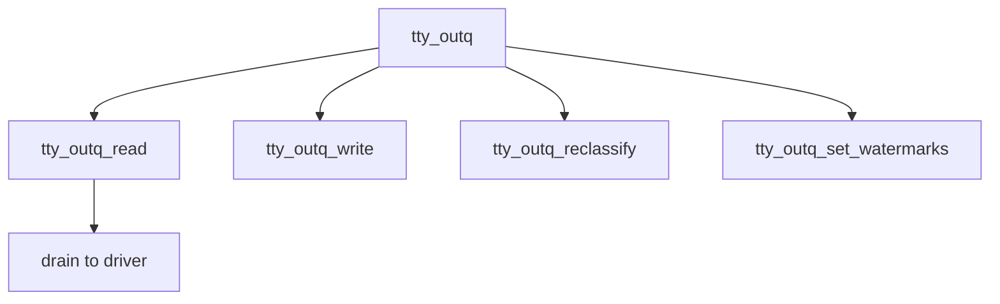

# Component: tty_outq.c

**Path:** `sys/kern/tty_outq.c`
**Type:** File
**Maps to:** `.discovery/sys/kern/tty_outq.md`

## Purpose

TTY output queue - buffering and management of terminal output queue.

## Structure



## Key Functions

| Function | Purpose | Signature |
|----------|---------|-----------|
| `tty_outq_read` | Read | `int tty_outq_read(struct tty *tp, struct uio *uio, int ioflag)` |
| `tty_outq_write` | Write | `int tty_outq_write(struct tty *tp, const void *buf, int len)` |
| `tty_outq_reclassify` | Reclassify | `void tty_outq_reclassify(struct tty *tp, int cl)` |
| `tty_outq_set_watermarks` | Set marks | `void tty_outq_set_watermarks(struct tty *tp, int low, int high)` |

## Structure

```c
struct ttyoutq_block {
    struct ttyoutq_block *tob_next;  // Next block
    char tob_data[TTYOUTQ_DATASIZE]; // Data
};
```

## Constants

| Constant | Description |
|----------|-------------|
| `TTYOUTQ_DATASIZE` | Block size |

## Use Cases

| Use | Description |
|-----|-------------|
| `output` | Output buffering |

## Includes

- `sys/tty.h` - TTY definitions
- `vm/uma.h` - UMA allocator