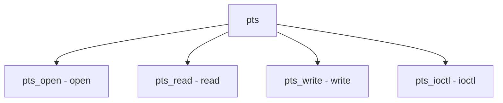

# Component: tty_pts.c

**Path:** `sys/kern/tty_pts.c`
**Type:** File
**Maps to:** `.discovery/sys/kern/tty_pts.md`

## Purpose

Pseudo-terminal slave device - /dev/pts/* device implementation.

## Structure

## Key Functions

| Function | Purpose | Signature |
|----------|---------|-----------|
| `pts_open` | Open | `int pts_open(struct cdev *dev, int mode, int type, struct thread *td)` |
| `pts_read` | Read | `int pts_read(struct cdev *dev, struct uio *uio, int flags)` |
| `pts_write` | Write | `int pts_write(struct cdev *dev, struct uio *uio, int flags)` |
| `pts_ioctl` | Ioctl | `int pts_ioctl(struct cdev *dev, u_long cmd, void *data, int fflag, struct thread *td)` |

## Compatibility

| Compat | Description |
|--------|-------------|
| `PTS_COMPAT` | FreeBSD compat |
| `PTS_EXTERNAL` | pty compat |
| `PTS_LINUX` | Linux compat |

## Use Cases

| Use | Description |
|-----|-------------|
| `pty` | Pseudo-terminal |

## Includes

- `sys/tty.h` - TTY definitions
- `sys/serial.h` - Serial definitions