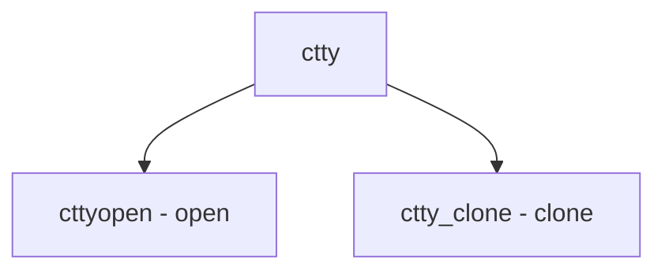

# Component: tty_tty.c

**Path:** `sys/kern/tty_tty.c`
**Type:** File
**Maps to:** `.discovery/sys/kern/tty_tty.md`

## Purpose

Controlling TTY - /dev/tty implementation and controlling terminal handling.

## Structure

## Key Functions

| Function | Purpose | Signature |
|----------|---------|-----------|
| `cttyopen` | Open | `static int cttyopen(struct cdev *dev, int flag, int mode, struct thread *td)` |
| `ctty_clone` | Clone | `static void ctty_clone(void *arg, struct ucred *cred, char *name, int namelen, struct cdev **dev)` |

## Device

| Device | Description |
|--------|-------------|
| `ctty` | Controlling TTY |

## Use Cases

| Use | Description |
|-----|-------------|
| `tty` | Controlling terminal |

## Includes

- `fs/devfs/devfs.h` - Devfs definitions