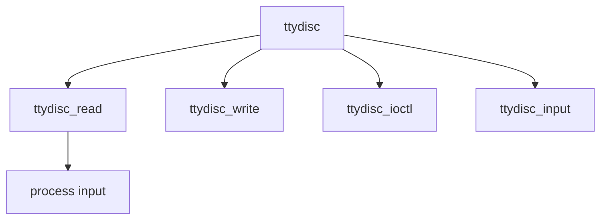

# Component: tty_ttydisc.c

**Path:** `sys/kern/tty_ttydisc.c`
**Type:** File
**Maps to:** `.discovery/sys/kern/tty_ttydisc.md`

## Purpose

Standard TTYDISC - termios line discipline implementation for terminal I/O processing.

## Structure

## Key Functions

| Function | Purpose | Signature |
|----------|---------|-----------|
| `ttydisc_read` | Read | `int ttydisc_read(struct tty *tp, struct uio *uio, int ioflag)` |
| `ttydisc_write` | Write | `int ttydisc_write(struct tty *tp, struct uio *uio, int ioflag)` |
| `ttydisc_ioctl` | Ioctl | `int ttydisc_ioctl(struct tty *tp, u_long cmd, void *data, int fflag, struct thread *td)` |
| `ttydisc_input` | Input | `void ttydisc_input(struct tty *tp, struct tty_signal_char *scc)` |

## Statistics

| Stat | Description |
|------|-------------|
| `tty_nin` | Bytes received |
| `tty_nout` | Bytes transmitted |

## Use Cases

| Use | Description |
|-----|-------------|
| `terminal` | Terminal I/O |
| `line discipline` | Termios |

## Includes

- `sys/tty.h` - TTY definitions
- `sys/ttydisc.h` - TTY discipline
- `teken/teken.h` - Terminal emulation