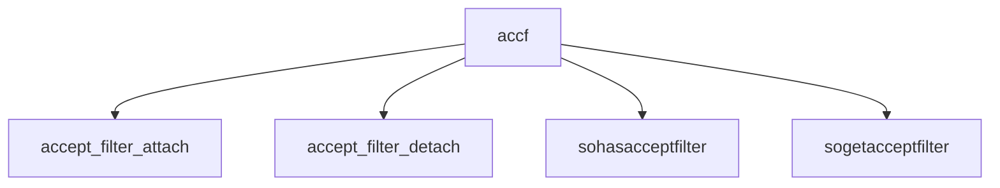

# Component: uipc_accf.c

**Path:** `sys/kern/uipc_accf.c`
**Type:** File
**Maps to:** `.discovery/sys/kern/uipc_accf.md`

## Purpose

Accept filters - pre-accept socket filtering for improved performance on listen sockets.

## Structure

## Key Functions

| Function | Purpose | Signature |
|----------|---------|-----------|
| `accept_filter_attach` | Attach | `int accept_filter_attach(struct socket *so, struct accept_filter *af)` |
| `accept_filter_detach` | Detach | `int accept_filter_detach(struct socket *so)` |
| `sohasacceptfilter` | Has filter | `int sohasacceptfilter(struct socket *so)` |
| `sogetacceptfilter` | Get filter | `struct accept_filter *sogetacceptfilter(struct socket *so)` |

## Filters

| Filter | Description |
|--------|-------------|
| `dataready` | Data ready |
| `connsready` | Connections ready |

## Use Cases

| Use | Description |
|-----|-------------|
| `socket` | Accept filtering |

## Includes

- `sys/socket.h` - Socket definitions
- `sys/socketvar.h` - Socket var