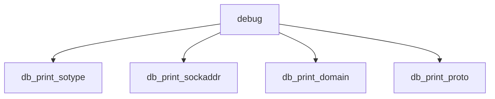

# Component: uipc_debug.c

**Path:** `sys/kern/uipc_debug.c`
**Type:** File
**Maps to:** `.discovery/sys/kern/uipc_debug.md`

## Purpose

DDB debugger routines - socket and protocol debugging commands for DDB.

## Structure

## Key Functions

| Function | Purpose | Signature |
|----------|---------|-----------|
| `db_print_sotype` | Print type | `static void db_print_sotype(short so_type)` |
| `db_print_sockaddr` | Print addr | `static void db_print_sockaddr(struct sockaddr *sa)` |
| `db_print_domain` | Print domain | `static void db_print_domain(struct domain *dp)` |
| `db_print_proto` | Print proto | `static void db_print_proto(struct protosw *pr)` |

## Use Cases

| Use | Description |
|-----|-------------|
| `debug` | DDB debugging |
| `ddb` | Kernel debugger |

## Includes

- `ddb/ddb.h` - DDB definitions