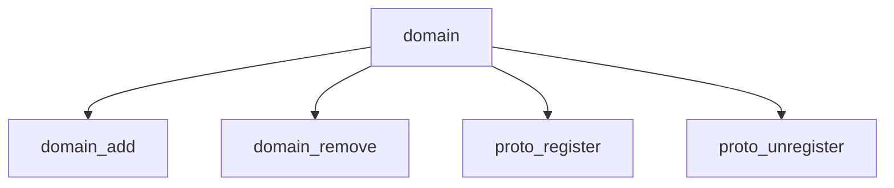

# Component: uipc_domain.c

**Path:** `sys/kern/uipc_domain.c`
**Type:** File
**Maps to:** `.discovery/sys/kern/uipc_domain.md`

## Purpose

Protocol domain - domain registration and protocol switch management for socket layers.

## Structure



## Key Functions

| Function | Purpose | Signature |
|----------|---------|-----------|
| `domain_add` | Add | `int domain_add(struct domain *dp)` |
| `domain_remove` | Remove | `int domain_remove(struct domain *dp)` |
| `proto_register` | Register proto | `int proto_register(struct protosw *pr, int flags)` |
| `proto_unregister` | Unregister | `void proto_unregister(struct protosw *pr)` |

## Domain Structure

```c
struct domain {
    int dom_family;              // Family
    struct protosw *dom_protosw; // Protosw
    struct domain *dom_next;    // Next
};
```

## Domains

| Domain | Description |
|--------|-------------|
| `PF_INET` | IPv4 |
| `PF_INET6` | IPv6 |
| `PF_LOCAL` | Local |
| `PF_ROUTE` | Routing |

## Use Cases

| Use | Description |
|-----|-------------|
| `socket` | Socket domains |

## Includes

- `sys/domain.h` - Domain definitions
- `sys/protosw.h` - Protocol switch