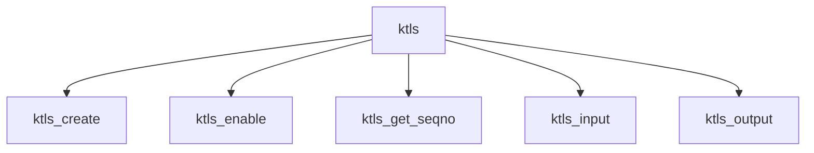

# Component: uipc_ktls.c

**Path:** `sys/kern/uipc_ktls.c`
**Type:** File
**Maps to:** `.discovery/sys/kern/uipc_ktls.md`

## Purpose

Kernel TLS - kernel-level TLS for socket encryption (kernel TLS/ktls).

## Structure

## Key Functions

| Function | Purpose | Signature |
|----------|---------|-----------|
| `ktls_create` | Create | `int ktls_create(struct socket *so, struct ktls_session *session)` |
| `ktls_enable` | Enable | `int ktls_enable(struct socket *so, struct ktls_enable_args *uap)` |
| `ktls_get_seqno` | Get seqno | `uint64_t ktls_get_seqno(struct mbuf *m, struct ktls_session *tls)` |
| `ktls_input` | Input | `int ktls_input(struct mbuf *m, struct ktls_session *tls, int *off)` |
| `ktls_output` | Output | `int ktls_output(struct mbuf *m, struct ktls_session *tls)` |

## TLS Operations

| Op | Description |
|----|-------------|
| `TLS_RDWR` | Read/write |
| `TLS_RDWR_SH` | Read/write shared |

## Use Cases

| Use | Description |
|-----|-------------|
| `tls` | TLS encryption |
| `socket` | Kernel TLS |

## Includes

- `sys/ktls.h` - Kernel TLS definitions