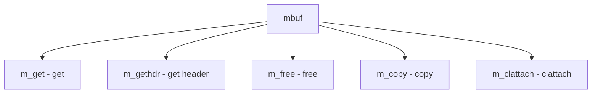

# Component: uipc_mbuf.c

**Path:** `sys/kern/uipc_mbuf.c`
**Type:** File
**Maps to:** `.discovery/sys/kern/uipc_mbuf.md`

## Purpose

Mbuf management - memory buffer management for network I/O and socket operations.

## Structure

## Key Functions

| Function | Purpose | Signature |
|----------|---------|-----------|
| `m_get` | Get mbuf | `struct mbuf *m_get(int wait, int type)` |
| `m_gethdr` | Get header | `struct mbuf *m_gethdr(int wait, int type)` |
| `m_free` | Free | `struct mbuf *m_free(struct mbuf *m)` |
| `m_copy` | Copy | `struct mbuf *m_copy(struct mbuf *m, int off, int len)` |
| `m_clattach` | Attach cluster | `int m_clattach(struct mbuf *m, struct mbuf *m_cl, int wait, int type)` |

## Mbuf Types

| Type | Description |
|------|-------------|
| `MT_DATA` | Data |
| `MT_HEADER` | Header |
| `MT_SONAME` | Socket name |

## Use Cases

| Use | Description |
|-----|-------------|
| `network` | Network I/O |
| `socket` | Socket buffers |

## Includes

- `sys/mbuf.h` - Mbuf definitions