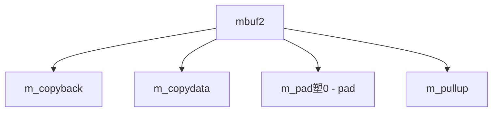

# Component: uipc_mbuf2.c

**Path:** `sys/kern/uipc_mbuf2.c`
**Type:** File
**Maps to:** `.discovery/sys/kern/uipc_mbuf2.md`

## Purpose

Mbuf utilities - additional mbuf manipulation functions (from KAME/WIDE project).

## Structure

## Key Functions

| Function | Purpose | Signature |
|----------|---------|-----------|
| `m_copyback` | Copy back | `int m_copyback(struct mbuf *m, int off, int len, const void *cp)` |
| `m_copydata` | Copy data | `void m_copydata(const struct mbuf *m, int off, int len, void *cp)` |
| `m_pullup` | Pull up | `struct mbuf *m_pullup(struct mbuf *m, int len)` |

## Use Cases

| Use | Description |
|-----|-------------|
| `network` | Network I/O |
| `socket` | Socket buffers |

## Includes

- `sys/mbuf.h` - Mbuf definitions