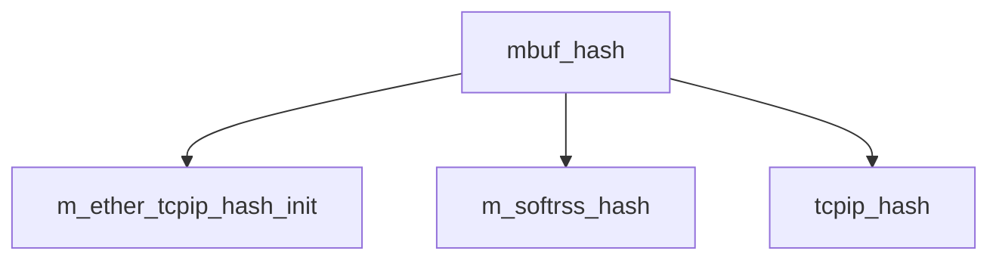

# Component: uipc_mbufhash.c

**Path:** `sys/kern/uipc_mbufhash.c`
**Type:** File
**Maps to:** `.discovery/sys/kern/uipc_mbufhash.md`

## Purpose

Mbuf hashing - packet header hashing for classification and RSS (Receive Side Scaling).

## Structure

## Key Functions

| Function | Purpose | Signature |
|----------|---------|-----------|
| `m_ether_tcpip_hash_init` | Init | `uint32_t m_ether_tcpip_hash_init(void)` |
| `m_softrss_hash` | Soft RSS | `uint32_t m_softrss_hash(const struct mbuf *m, uint32_t hash)` |
| `tcpip_hash` | TCP/IP | `uint32_t tcpip_hash(const struct mbuf *m, uint8_t type)` |

## Use Cases

| Use | Description |
|-----|-------------|
| `rss` | Receive Side Scaling |
| `classification` | Packet classification |

## Includes

- `sys/mbuf.h` - Mbuf definitions