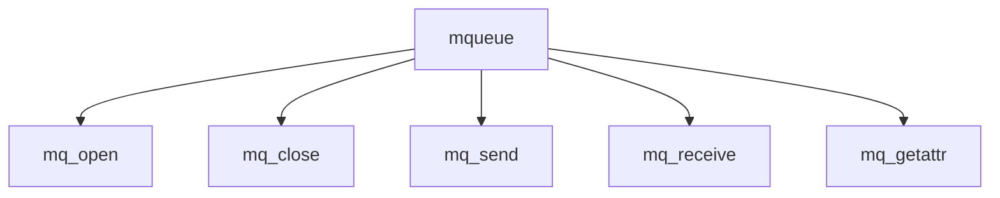

# Component: uipc_mqueue.c

**Path:** `sys/kern/uipc_mqueue.c`
**Type:** File
**Maps to:** `.discovery/sys/kern/uipc_mqueue.md`

## Purpose

POSIX message queues - POSIX message queue implementation with mqueue filesystem.

## Structure

## Key Functions

| Function | Purpose | Signature |
|----------|---------|-----------|
| `mq_open` | Open | `int mq_open(struct thread *td, struct mq_open_args *uap)` |
| `mq_close` | Close | `int mq_close(struct thread *td, struct mq_close_args *uap)` |
| `mq_send` | Send | `int mq_send(struct thread *td, struct mq_send_args *uap)` |
| `mq_receive` | Receive | `int mq_receive(struct thread *td, struct mq_receive_args *uap)` |
| `mq_getattr` | Get attr | `int mq_getattr(struct thread *td, struct mq_getattr_args *uap)` |

## Message Queue

| Function | Description |
|----------|-------------|
| `mq_open` | Open queue |
| `mq_send` | Send message |
| `mq_receive` | Receive message |

## Use Cases

| Use | Description |
|-----|-------------|
| `posix` | POSIX IPC |
| `mqueue` | Message queue |

## Includes

- `sys/mqueue.h` - Mqueue definitions