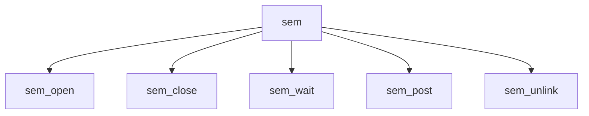

# Component: uipc_sem.c

**Path:** `sys/kern/uipc_sem.c`
**Type:** File
**Maps to:** `.discovery/sys/kern/uipc_sem.md`

## Purpose

POSIX named semaphores - POSIX semaphore implementation with semfs filesystem.

## Structure

## Key Functions

| Function | Purpose | Signature |
|----------|---------|-----------|
| `sem_open` | Open | `int sem_open(struct thread *td, struct sem_open_args *uap)` |
| `sem_close` | Close | `int sem_close(struct thread *td, struct sem_close_args *uap)` |
| `sem_wait` | Wait | `int sem_wait(struct thread *td, struct sem_wait_args *uap)` |
| `sem_post` | Post | `int sem_post(struct thread *td, struct sem_post_args *uap)` |
| `sem_unlink` | Unlink | `int sem_unlink(struct thread *td, struct sem_unlink_args *uap)` |

## Semaphore Operations

| Op | Description |
|----|-------------|
| `sem_wait` | Decrement |
| `sem_post` | Increment |

## Use Cases

| Use | Description |
|-----|-------------|
| `posix` | POSIX IPC |
| `semaphore` | Named semaphore |

## Includes

- `sys/ksem.h` - Kernel semaphore definitions