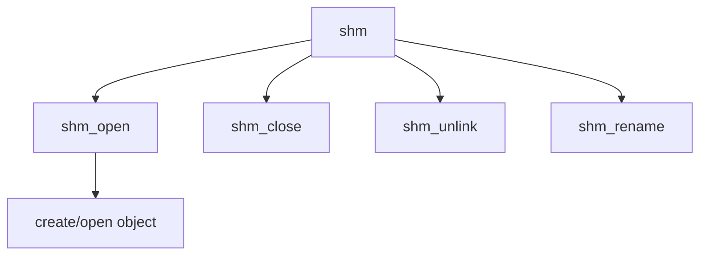

# Component: uipc_shm.c

**Path:** `sys/kern/uipc_shm.c`
**Type:** File
**Maps to:** `.discovery/sys/kern/uipc_shm.md`

## Purpose

POSIX shared memory - POSIX shared memory objects via shm_open/shm_unlink.

## Structure

## Key Functions

| Function | Purpose | Signature |
|----------|---------|-----------|
| `shm_open` | Open | `int shm_open(struct thread *td, struct shm_open_args *uap)` |
| `shm_close` | Close | `int shm_close(struct thread *td, struct shm_close_args *uap)` |
| `shm_unlink` | Unlink | `int shm_unlink(struct thread *td, struct shm_unlink_args *uap)` |
| `shm_rename` | Rename | `int shm_rename(struct thread *td, struct shm_rename_args *uap)` |

## Shared Memory

| Op | Description |
|----|-------------|
| `shm_open` | Open/create |
| `shm_unlink` | Remove |

## Use Cases

| Use | Description |
|-----|-------------|
| `posix` | POSIX IPC |
| `shared` | Shared memory |

## Includes

- `sys/mman.h` - Memory management definitions