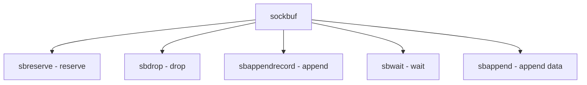

# Component: uipc_sockbuf.c

**Path:** `sys/kern/uipc_sockbuf.c`
**Type:** File
**Maps to:** `.discovery/sys/kern/uipc_sockbuf.md`

## Purpose

Socket buffer management - send/receive buffers for sockets with flow control.

## Structure

## Key Functions

| Function | Purpose | Signature |
|----------|---------|-----------|
| `sbreserve` | Reserve | `int sbreserve(struct sockbuf *sb, u_long cc)` |
| `sbdrop` | Drop | `void sbdrop(struct sockbuf *sb, int len)` |
| `sbdroprecord` | Drop record | `void sbdroprecord(struct sockbuf *sb)` |
| `sbappendrecord` | Append record | `int sbappendrecord(struct sockbuf *sb, struct mbuf *m0)` |
| `sbwait` | Wait | `int sbwait(struct sockbuf *sb)` |
| `sbappend` | Append | `int sbappend(struct sockbuf *sb, struct mbuf *m0)` |

## Socket Buffer Limits

| Limit | Description |
|-------|-------------|
| `sb_hiwat` | High water |
| `sb_lowat` | Low water |
| `sb_mbcnt` | Mbuf count |
| `sb_ccnt` | Cluster count |

## Use Cases

| Use | Description |
|-----|-------------|
| `socket` | Socket buffering |

## Includes

- `sys/socketvar.h` - Socket var definitions