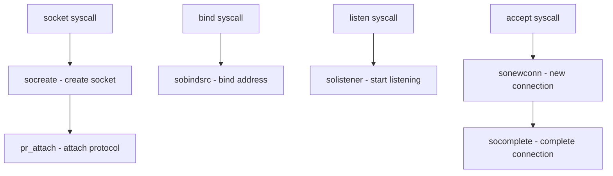

# Component: uipc_socket.c

**Path:** `sys/kern/uipc_socket.c`
**Type:** File
**Maps to:** `.discovery/sys/kern/uipc_socket.md`

## Purpose

BSD socket layer - implements socket abstraction for network I/O. Core of FreeBSD's socket API supporting TCP, UDP, raw sockets, Unix domain sockets, and more.

## Structure

## Key Functions

| Function | Purpose | Signature |
|----------|---------|-----------|
| `socreate` | Create socket | `int socreate(int dom, struct socket **aso, int type, int proto)` |
| `sobind` | Bind socket | `int sobind(struct socket *so, struct sockaddr *nam)` |
| `solisten` | Start listen | `int solisten(struct socket *so, int backlog)` |
| `soaccept` | Accept connection | `int soaccept(struct socket *so, struct sockaddr **nam)` |
| `soconnect` | Connect socket | `int soconnect(struct socket *so, struct sockaddr *nam)` |
| `sosend` | Send data | `int sosend(struct socket *so, struct sockaddr *addr, ...)` |
| `soreceive` | Receive data | `int soreceive(struct socket *so, struct sockaddr **addr, ...)` |
| `soclose` | Close socket | `int soclose(struct socket *so)` |
| `soshutdown` | Shutdown | `int soshutdown(struct socket *so, int how)` |
| `sogetlock` | Get lock | `int sogetlock(struct socket *so, int locktype)` |

## Socket States

| State | Description |
|-------|-------------|
| `SS_NOFDREF` | No file descriptor |
| `SS_ISCONNECTING` | Connection in progress |
| `SS_ISCONNECTED` | Connected |
| `SS_ISDISCONNECTING` | Disconnect in progress |
| `SS_CANTSENDMORE` | Can't send more |

## Address Families

| Family | Description |
|--------|-------------|
| `AF_INET` | IPv4 |
| `AF_INET6` | IPv6 |
| `AF_UNIX` | Unix domain |
| `AF_LOCAL` | Local (alias) |
| `AF_ROUTE` | Routing socket |
| `AF_SNA` | SNA |

## Socket Types

| Type | Description |
|------|-------------|
| `SOCK_STREAM` | Stream (TCP) |
| `SOCK_DGRAM` | Datagram (UDP) |
| `SOCK_RAW` | Raw socket |

## Includes

- `sys/socketvar.h` - Socket variables
- `sys/socket.h` - Socket definitions
- `net/vnet.h` - Virtual network

## Depends On

- `netinet/in.c` for IPv4
- `netinet6/in6.c` for IPv6
- `netgraph/ng_ksocket.c` for netgraph sockets