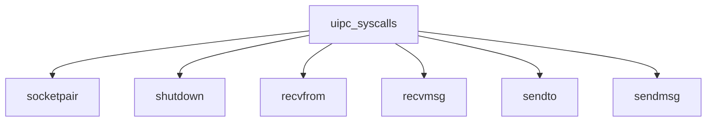

# Component: uipc_syscalls.c

**Path:** `sys/kern/uipc_syscalls.c`
**Type:** File
**Maps to:** `.discovery/sys/kern/uipc_syscalls.md`

## Purpose

IPC syscalls - socketpair, shutdown, recvfrom, recvmsg, sendto, sendmsg syscalls.

## Structure

## Key Functions

| Function | Purpose | Signature |
|----------|---------|-----------|
| `socketpair` | Socket pair | `int socketpair(struct thread *td, struct socketpair_args *uap)` |
| `shutdown` | Shutdown | `int shutdown(struct thread *td, struct shutdown_args *uap)` |
| `recvfrom` | Recv from | `int recvfrom(struct thread *td, struct recvfrom_args *uap)` |
| `recvmsg` | Recv msg | `int recvmsg(struct thread *td, struct recvmsg_args *uap)` |
| `sendto` | Send to | `int sendto(struct thread *td, struct sendto_args *uap)` |
| `sendmsg` | Send msg | `int sendmsg(struct thread *td, struct sendmsg_args *uap)` |

## Use Cases

| Use | Description |
|-----|-------------|
| `socket` | Socket IPC |

## Includes

- `sys/socket.h` - Socket definitions