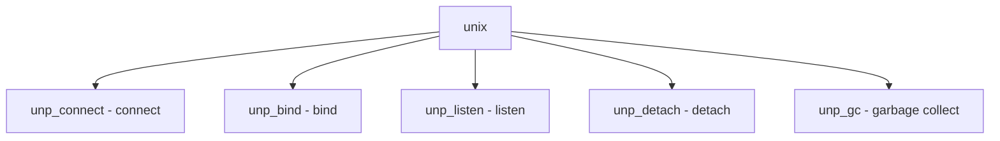

# Component: uipc_usrreq.c

**Path:** `sys/kern/uipc_usrreq.c`
**Type:** File
**Maps to:** `.discovery/sys/kern/uipc_usrreq.md`

## Purpose

UNIX domain sockets - local socket implementation with filesystem namespace binding and ancillary data (fd/credential passing).

## Structure



## Key Functions

| Function | Purpose | Signature |
|----------|---------|-----------|
| `unp_connect` | Connect | `int unp_connect(struct socket *so, struct sockaddr *nam)` |
| `unp_bind` | Bind | `int unp_bind(struct socket *so, struct sockaddr *nam, struct thread *td)` |
| `unp_listen` | Listen | `int unp_listen(struct socket *so, struct thread *td)` |
| `unp_detach` | Detach | `void unp_detach(struct unpcb *unp)` |
| `unp_gc` | GC | `void unp_gc(struct mbuf *m)` |

## Ancillary Data

| Type | Description |
|------|-------------|
| `SCM_RIGHTS` | File descriptors |
| `SCM_CREDS` | Credentials |

## Structure

```c
struct unpcb {
    struct socket *unp_socket;   // Socket
    struct vnode *unp_vnode;    // Vnode
    struct unp_head unp_refs;    // References
};
```

## Use Cases

| Use | Description |
|-----|-------------|
| `local` | Local IPC |
| `ancillary` | FD passing |

## Includes

- `sys/unpcb.h` - UNIX PCB
- `sys/un.h` - UNIX headers