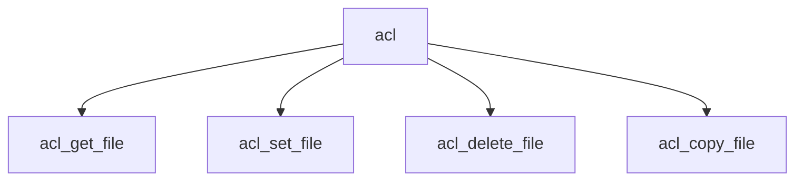

# Component: vfs_acl.c

**Path:** `sys/kern/vfs_acl.c`
**Type:** File
**Maps to:** `.discovery/sys/kern/vfs_acl.md`

## Purpose

ACL system calls - POSIX.1e and NFSv4 ACL operations on files and directories.

## Structure

## Key Functions

| Function | Purpose | Signature |
|----------|---------|-----------|
| `acl_get_file` | Get ACL | `int acl_get_file(struct thread *td, struct acl_get_file_args *uap)` |
| `acl_set_file` | Set ACL | `int acl_set_file(struct thread *td, struct acl_set_file_args *uap)` |
| `acl_delete_file` | Delete | `int acl_delete_file(struct thread *td, struct acl_delete_file_args *uap)` |
| `acl_copy_file` | Copy | `int acl_copy_file(const char *from, const char *to)` |

## ACL Types

| Type | Description |
|------|-------------|
| `ACL_TYPE_ACCESS` | Access ACL |
| `ACL_TYPE_DEFAULT` | Default ACL |
| `ACL_TYPE_NFS4` | NFSv4 ACL |

## Use Cases

| Use | Description |
|-----|-------------|
| `security` | ACL permissions |
| `nfs` | NFSv4 ACL |

## Includes

- `sys/acl.h` - ACL definitions