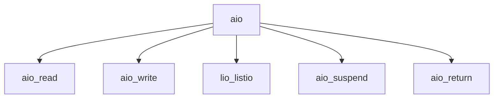

# Component: vfs_aio.c

**Path:** `sys/kern/vfs_aio.c`
**Type:** File
**Maps to:** `.discovery/sys/kern/vfs_aio.md`

## Purpose

Asynchronous I/O - POSIX 1003.1B AIO/LIO facility implementation.

## Structure

## Key Functions

| Function | Purpose | Signature |
|----------|---------|-----------|
| `aio_read` | Async read | `int aio_read(struct thread *td, struct aio_read_args *uap)` |
| `aio_write` | Async write | `int aio_write(struct thread *td, struct aio_write_args *uap)` |
| `lio_listio` | List I/O | `int lio_listio(struct thread *td, struct lio_listio_args *uap)` |
| `aio_suspend` | Suspend | `int aio_suspend(struct thread *td, struct aio_suspend_args *uap)` |
| `aio_return` | Return | `ssize_t aio_return(struct thread *td, struct aio_return_args *uap)` |

## AIO Operations

| Op | Description |
|----|-------------|
| `AIO_READ` | Async read |
| `AIO_WRITE` | Async write |
| `LIO_NOP` | No operation |

## Use Cases

| Use | Description |
|-----|-------------|
| `async` | Async I/O |
| `posix` | POSIX AIO |

## Includes

- `sys/aio.h` - AIO definitions