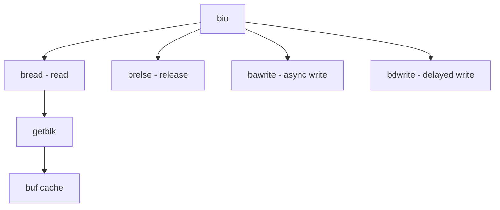

# Component: vfs_bio.c

**Path:** `sys/kern/vfs_bio.c`
**Type:** File
**Maps to:** `.discovery/sys/kern/vfs_bio.md`

## Purpose

Buffer I/O system - coherent VM object and buffer cache implementation for filesystem I/O.

## Structure



## Key Functions

| Function | Purpose | Signature |
|----------|---------|-----------|
| `bread` | Read | `int bread(struct vnode *vp, daddr_t blkno, int size, struct buf **bpp)` |
| `brelse` | Release | `void brelse(struct buf *bp)` |
| `bawrite` | Async write | `int bawrite(struct buf *bp)` |
| `bdwrite` | Delayed write | `int bdwrite(struct buf *bp)` |
| `getblk` | Get block | `int getblk(struct vnode *vp, daddr_t blkno, int size, int slpflags, int timo)` |
| `cluster_read` | Cluster | `int cluster_read(struct vnode *vp, struct uio *uio, int size)` |

## Buffer States

| State | Description |
|-------|-------------|
| `B_INVAL` | Invalid |
| `B_LOCKED` | Locked |
| `B_DELWRI` | Delayed write |
| `B_CACHE` | Cached |

## Buf Structure

```c
struct buf {
    struct vnode *b_vp;        // Vnode
    daddr_t b_lblkno;         // Logical block
    int b_bcount;            // Byte count
    void *b_data;            // Data
    int b_flags;             // Flags
};
```

## Use Cases

| Use | Description |
|-----|-------------|
| `buffer` | Buffer cache |
| `vfs` | VFS I/O |

## Includes

- `sys/buf.h` - Buffer definitions
- `sys/bio.h` - BIO definitions