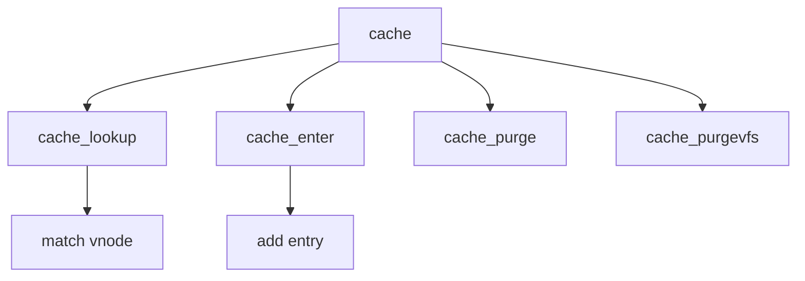

# Component: vfs_cache.c

**Path:** `sys/kern/vfs_cache.c`
**Type:** File
**Maps to:** `.discovery/sys/kern/vfs_cache.md`

## Purpose

Vnode name cache - directory name lookup cache (DNLC) for fast pathname resolution.

## Structure

## Key Functions

| Function | Purpose | Signature |
|----------|---------|-----------|
| `cache_lookup` | Lookup | `int cache_lookup(struct vnode *dvp, struct vnode **vpp, struct componentname *cnp)` |
| `cache_enter` | Enter | `void cache_enter(struct vnode *dvp, struct vnode *vp, struct componentname *cnp)` |
| `cache_purge` | Purge | `void cache_purge(struct vnode *vp)` |
| `cache_purgevfs` | Purge fs | `void cache_purgevfs(struct mount *mp)` |
| `cache_resolve` | Resolve | `int cache_resolve(struct nameidata *ndp)` |

## Cache Structure

| Field | Description |
|-------|-------------|
| `nc_hash` | Hash value |
| `nc_dvp` | Directory vnode |
| `nc_vp` | Target vnode |

## Use Cases

| Use | Description |
|-----|-------------|
| `namei` | Name lookup |
| `vfs` | VFS cache |

## Includes

- `sys/namei.h` - Namei definitions
- `sys/mount.h` - Mount definitions