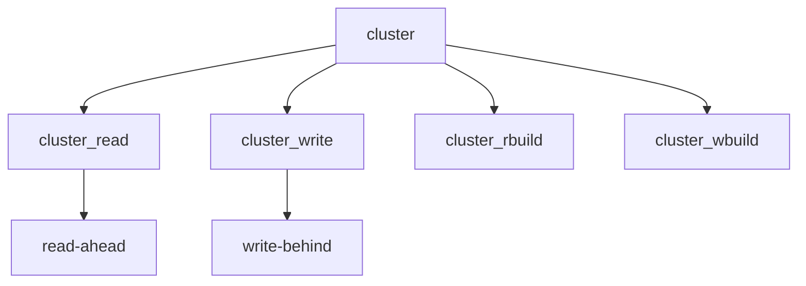

# Component: vfs_cluster.c

**Path:** `sys/kern/vfs_cluster.c`
**Type:** File
**Maps to:** `.discovery/sys/kern/vfs_cluster.md`

## Purpose

Cluster I/O - read-ahead and write-behind optimization for sequential I/O operations.

## Structure

## Key Functions

| Function | Purpose | Signature |
|----------|---------|-----------|
| `cluster_read` | Cluster read | `int cluster_read(struct vnode *vp, struct uio *uio, int ioflg, long seq)` |
| `cluster_write` | Cluster write | `int cluster_write(struct vnode *vp, struct uio *uio, int ioflg, long seq)` |
| `cluster_rbuild` | Build read | `struct buf *cluster_rbuild(struct vnode *vp, u_quad_t filesize, daddr_t lbn, daddr_t blkno, long size, int run, int gbflags, struct buf *fbp)` |
| `cluster_wbuild` | Build write | `struct cluster_save *cluster_wbuild(struct vnode *vp, struct uio *uio, int gbflags)` |

## Use Cases

| Use | Description |
|-----|-------------|
| `sequential` | Sequential I/O |
| `performance` | Read-ahead/write-behind |

## Includes

- `sys/buf.h` - Buffer definitions
- `sys/vnode.h` - Vnode definitions