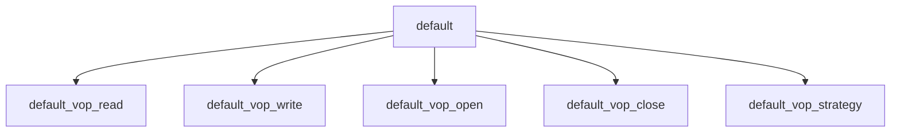

# Component: vfs_default.c

**Path:** `sys/kern/vfs_default.c`
**Type:** File
**Maps to:** `.discovery/sys/kern/vfs_default.md`

## Purpose

Default VFS operations - fallback implementation for filesystems that don't provide their own VFS operations.

## Structure

## Key Functions

| Function | Purpose | Signature |
|----------|---------|-----------|
| `default_vnop_read` | Read | `int default_vnop_read(struct vop_read_args *)` |
| `default_vnop_write` | Write | `int default_vnop_write(struct vop_write_args *)` |
| `default_vnop_open` | Open | `int default_vnop_open(struct vop_open_args *)` |
| `default_vnop_close` | Close | `int default_vnop_close(struct vop_close_args *)` |
| `default_vnop_strategy` | Strategy | `int default_vnop_strategy(struct vop_strategy_args *)` |

## VFS Operations

| Op | Description |
|----|-------------|
| `VOP_READ` | Read |
| `VOP_WRITE` | Write |
| `VOP_OPEN` | Open |
| `VOP_CLOSE` | Close |

## Use Cases

| Use | Description |
|-----|-------------|
| `vfs` | VFS fallback |
| `filesystem` | Default ops |

## Includes

- `sys/vnode.h` - Vnode definitions
- `sys/mount.h` - Mount definitions