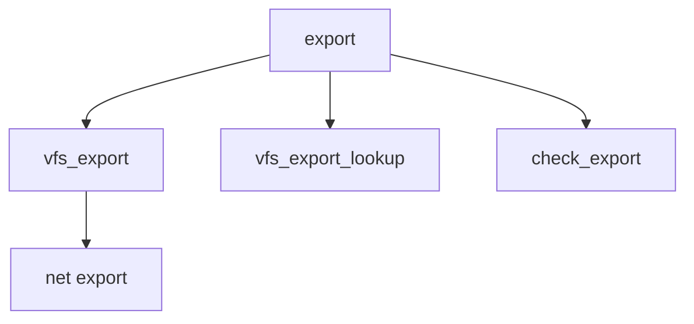

# Component: vfs_export.c

**Path:** `sys/kern/vfs_export.c`
**Type:** File
**Maps to:** `.discovery/sys/kern/vfs_export.md`

## Purpose

NFS export - NFS mount export table and access control.

## Structure



## Key Functions

| Function | Purpose | Signature |
|----------|---------|-----------|
| `vfs_export` | Export | `int vfs_export(struct mount *mp, struct export_args *uap)` |
| `vfs_export_lookup` | Lookup | `struct netexport *vfs_export_lookup(struct mount *mp, struct netcred *nec)` |
| `check_export` | Check | `int check_export(struct vnode *vp, struct mount *mp, int exflags)` |

## Structure

```c
struct netexport {
    struct netcred *ne_public;    // Public
    struct radix_node_head *ne_rnh[AF_MAX+1]; // Radix
};
```

## Use Cases

| Use | Description |
|-----|-------------|
| `nfs` | NFS export |
| `security` | Access control |

## Includes

- `sys/mount.h` - Mount definitions