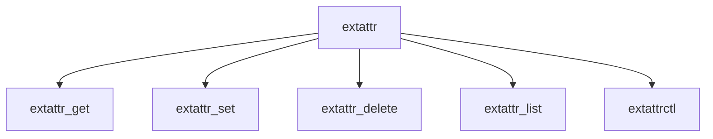

# Component: vfs_extattr.c

**Path:** `sys/kern/vfs_extattr.c`
**Type:** File
**Maps to:** `.discovery/sys/kern/vfs_extattr.md`

## Purpose

Extended attributes - VFS extended attribute (xattr) operations on vnodes.

## Structure

## Key Functions

| Function | Purpose | Signature |
|----------|---------|-----------|
| `extattr_get` | Get | `int extattr_get(struct vnode *vp, int attrnamespace, const char *name, void *data, size_t nbytes)` |
| `extattr_set` | Set | `int extattr_set(struct vnode *vp, int attrnamespace, const char *name, const void *data, size_t nbytes)` |
| `extattr_delete` | Delete | `int extattr_delete(struct vnode *vp, int attrnamespace, const char *name)` |
| `extattr_list` | List | `int extattr_list(struct vnode *vp, int attrnamespace, void *data, size_t nbytes)` |
| `extattrctl` | Control | `int extattrctl(struct thread *td, struct extattrctl_args *uap)` |

## Namespaces

| Namespace | Description |
|-----------|-------------|
| `EXTATTR_NAMESPACE_USER` | User namespace |
| `EXTATTR_NAMESPACE_SYSTEM` | System namespace |

## Use Cases

| Use | Description |
|-----|-------------|
| `xattr` | Extended attributes |

## Includes

- `sys/extattr.h` - Extended attr definitions