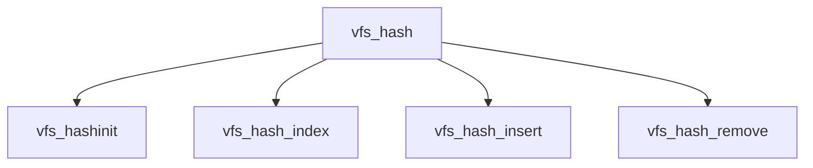

# Component: vfs_hash.c

**Path:** `sys/kern/vfs_hash.c`
**Type:** File
**Maps to:** `.discovery/sys/kern/vfs_hash.md`

## Purpose

VFS hash table - hash table for vnode lookup and management.

## Structure



## Key Functions

| Function | Purpose | Signature |
|----------|---------|-----------|
| `vfs_hashinit` | Init | `void vfs_hashinit(void *dummy)` |
| `vfs_hash_index` | Index | `u_int vfs_hash_index(struct vnode *vp)` |
| `vfs_hash_insert` | Insert | `int vfs_hash_insert(struct vnode *vp, struct vnode **vpp, int flags)` |
| `vfs_hash_remove` | Remove | `void vfs_hash_remove(struct vnode *vp)` |

## Structure

```c
static LIST_HEAD(vfs_hash_head, vnode) *vfs_hash_tbl;
static u_long vfs_hash_mask;
```

## Use Cases

| Use | Description |
|-----|-------------|
| `vnode` | Vnode lookup |
| `vfs` | VFS hash |

## Includes

- `sys/vnode.h` - Vnode definitions