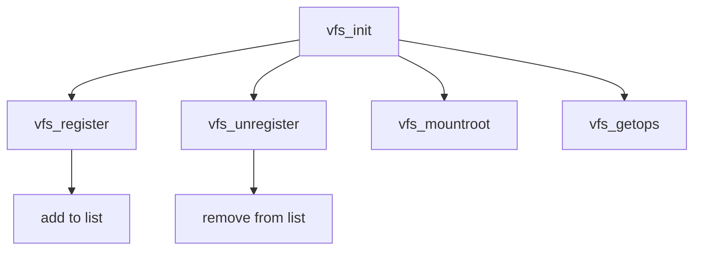

# Component: vfs_init.c

**Path:** `sys/kern/vfs_init.c`
**Type:** File
**Maps to:** `.discovery/sys/kern/vfs_init.md`

## Purpose

VFS initialization - VFS subsystem initialization, registration, and vnode management.

## Structure

## Key Functions

| Function | Purpose | Signature |
|----------|---------|-----------|
| `vfs_register` | Register | `static int vfs_register(struct vfsconf *vfc)` |
| `vfs_unregister` | Unregister | `static int vfs_unregister(struct vfsconf *vfc)` |
| `vfs_mountroot` | Mount root | `int vfs_mountroot(struct mount *mp)` |
| `vfs_getops` | Get ops | `struct vfsops *vfs_getops(const char *name)` |
| `vfs_getnewvnode` | New vnode | `int vfs_getnewvnode(struct vnode **vpp)` |

## Vnode Management

| Function | Description |
|----------|-------------|
| `vfs_getnewvnode` | Get new vnode |
| `vfs_reclaim` | Reclaim vnode |

## Use Cases

| Use | Description |
|-----|-------------|
| `vfs` | VFS init |

## Includes

- `sys/vnode.h` - Vnode definitions
- `sys/mount.h` - Mount definitions