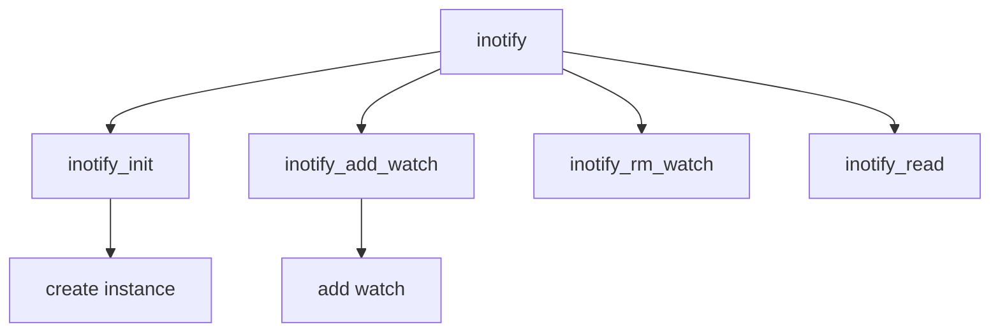

# Component: vfs_inotify.c

**Path:** `sys/kern/vfs_inotify.c`
**Type:** File
**Maps to:** `.discovery/sys/kern/vfs_inotify.md`

## Purpose

Inotify - Linux-compatible filesystem event notification.

## Structure

## Key Functions

| Function | Purpose | Signature |
|----------|---------|-----------|
| `inotify_init` | Init | `int inotify_init(struct thread *td)` |
| `inotify_add_watch` | Add watch | `int inotify_add_watch(struct thread *td, struct inotify_add_watch_args *uap)` |
| `inotify_rm_watch` | Remove watch | `int inotify_rm_watch(struct thread *td, struct inotify_rm_watch_args *uap)` |
| `inotify_read` | Read | `int inotify_read(struct file *fp, struct uio *uio, int flags)` |

## Events

| Event | Description |
|-------|-------------|
| `IN_ACCESS` | Access |
| `IN_MODIFY` | Modify |
| `IN_CREATE` | Create |
| `IN_DELETE` | Delete |
| `IN_RENAME` | Rename |

## Sysctls

| Sysctl | Description |
|--------|-------------|
| `max_queued_events` | Max events |
| `max_user_instances` | Max instances |
| `max_user_watches` | Max watches |

## Use Cases

| Use | Description |
|-----|-------------|
| `notification` | FS events |
| `linux` | Linux compat |

## Includes

- `sys/inotify.h` - Inotify definitions