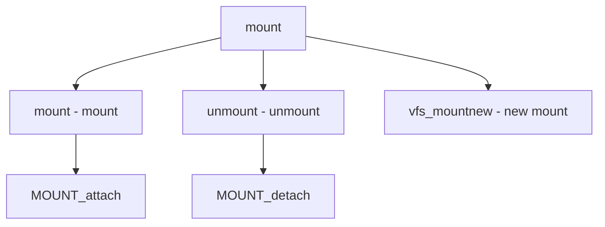

# Component: vfs_mount.c

**Path:** `sys/kern/vfs_mount.c`
**Type:** File
**Maps to:** `.discovery/sys/kern/vfs_mount.md`

## Purpose

Filesystem mount - mount/umount system calls and mount point management.

## Structure



## Key Functions

| Function | Purpose | Signature |
|----------|---------|-----------|
| `mount` | Mount | `int mount(struct thread *td, struct mount_args *uap)` |
| `unmount` | Unmount | `int unmount(struct thread *td, struct unmount_args *uap)` |
| `vfs_mountnew` | New mount | `int vfs_mountnew(struct thread *td, struct vfcachemount_args *uap)` |
| `vfs_getvfs` | Get fs | `struct mount *vfs_getvfs(int fsid)` |

## Flags

| Flag | Description |
|------|-------------|
| `MNT_RDONLY` | Read-only |
| `MNT_NOSUID` | No suid |
| `MNT_NODEV` | No dev |
| `MNT_UNION` | Union |

## Structure

```c
struct mount {
    struct vfsops *mnt_vfc->vfc_vfsops;  // VFS ops
    struct vnode *mnt_vnodelist;         // Vnode list
    int mnt_flag;                       // Flags
    int mnt_cnt;                       // Ref count
};
```

## Use Cases

| Use | Description |
|-----|-------------|
| `filesystem` | Mount fs |

## Includes

- `sys/mount.h` - Mount definitions