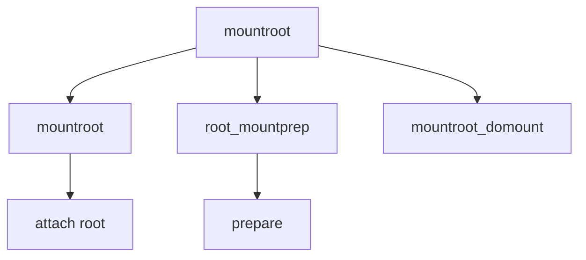

# Component: vfs_mountroot.c

**Path:** `sys/kern/vfs_mountroot.c`
**Type:** File
**Maps to:** `.discovery/sys/kern/vfs_mountroot.md`

## Purpose

Root mount - root filesystem mounting during kernel boot.

## Structure

## Key Functions

| Function | Purpose | Signature |
|----------|---------|-----------|
| `mountroot` | Mount root | `void mountroot(void)` |
| `mountroot_domount` | Do mount | `static int mountroot_domount(struct mount *mp, char *fspec)` |
| `root_mountprep` | Prepare | `static void root_mountprep(struct mount *mp)` |

## Root Mount Process

| Step | Description |
|------|-------------|
| `1` | Prepare mount |
| `2` | Find root device |
| `3` | Mount root |

## Use Cases

| Use | Description |
|-----|-------------|
| `boot` | Root mount |

## Includes

- `sys/mount.h` - Mount definitions