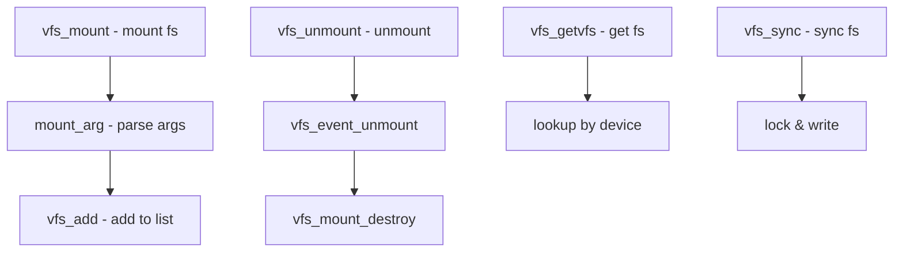

# Component: vfs_subr.c

**Path:** `sys/kern/vfs_subr.c`
**Type:** File
**Maps to:** `.discovery/sys/kern/vfs_subr.md`

## Purpose

VFS (Virtual File System) subsystem utilities - core VFS operations used by all filesystems. Implements vnode operations, mount, unmount, and filesystem registration.

## Structure



## Key Functions

| Function | Purpose | Signature |
|----------|---------|-----------|
| `vfs_mount` | Mount filesystem | `int vfs_mount(struct thread *td, struct mount *mp, ...)` |
| `vfs_unmount` | Unmount | `int vfs_unmount(struct mount *mp, int mntflags)` |
| `vfs_sync` | Sync filesystem | `int vfs_sync(struct mount *mp, int waitfor)` |
| `vfs_getvfs` | Get vfs by device | `struct mount *vfs_getvfs(int fstype, ...)` |
| `vfs_add` | Add to vfs list | `int vfs_add(struct vnode *rootvp, ...)` |
| `vfs_del` | Remove from list | `void vfs_del(struct mount *mp)` |
| `vfs_busy` | Busy mount point | `int vfs_busy(struct mount *mp, int flags)` |
| `vfs_unbusy` | Unbusy mount | `void vfs_unbusy(struct mount *mp)` |
| `vfs_root` | Get root vnode | `int vfs_root(struct mount *mp, struct vnode **vpp)` |

## Vnode Operations

| Function | Purpose |
|----------|---------|
| `vn_open` | Open vnode |
| `vn_close` | Close vnode |
| `vn_rdwr` | Read/write vnode |
| `vn_lock` | Lock vnode |
| `vn_unlock` | Unlock vnode |

## Mount Structure

```c
struct mount {
    struct vfsops *mnt_vfc;     // Filesystem ops
    struct vnode *mnt_vnocontext; // Credentials
    struct label *mnt_label;       // MAC label
    int mnt_flag;                  // Flags
    int mnt_kern_flag;             // Kernel flags
    // ... more fields
};
```

## Filesystem Types

| Type | Name | Description |
|------|------|-------------|
| `MOUNT_FFS` | FFS | Unix File System |
| `MOUNT_UFS` | UFS | Universal FFS |
| `MOUNT_NFS` | NFS | Network FS |
| `MOUNT_MSDOSFS` | MSDOS | FAT FS |
| `MOUNT_CD9660` | ISO9660 | CD-ROM FS |
| `MOUNT_EXT2FS` | EXT2 | Linux ext2 |
| `MOUNT_ZFS` | ZFS | OpenZFS |

## Includes

- `sys/mount.h` - Mount definitions
- `sys/vnode.h` - Vnode operations
- `sys/vfs.h` - VFS definitions

## Depends On

- `vfs_vnops.c` for vnode ops
- `vfs_lookup.c` for path resolution