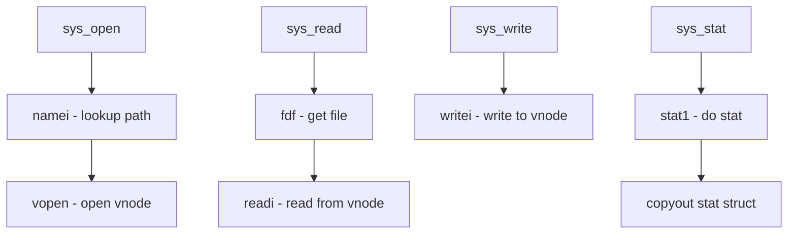

# Component: vfs_syscalls.c

**Path:** `sys/kern/vfs_syscalls.c`
**Type:** File
**Maps to:** `.discovery/sys/kern/vfs_syscalls.md`

## Purpose

VFS system calls - implements filesystem-related syscalls: open, close, read, write, lseek, stat, chmod, chown, link, unlink, rename, mkdir, rmdir, etc.

## Structure

## Key Functions

| Function | Purpose | Signature |
|----------|---------|-----------|
| `sys_open` | Open file | `int sys_open(struct thread *td, struct open_args *uap)` |
| `sys_close` | Close file | `int sys_close(struct thread *td, struct close_args *uap)` |
| `sys_read` | Read from fd | `int sys_read(struct thread *td, struct read_args *uap)` |
| `sys_write` | Write to fd | `int sys_write(struct thread *td, struct write_args *uap)` |
| `sys_lseek` | Seek in fd | `int sys_lseek(struct thread *td, struct lseek_args *uap)` |
| `sys_stat` | Get file status | `int sys_stat(struct thread *td, struct stat_args *uap)` |
| `sys_fstat` | Get fd status | `int sys_fstat(struct thread *td, struct fstat_args *uap)` |
| `sys_chmod` | Change mode | `int sys_chmod(struct thread *td, struct chmod_args *uap)` |
| `sys_chown` | Change owner | `int sys_chown(struct thread *td, struct chown_args *uap)` |
| `sys_link` | Create link | `int sys_link(struct thread *td, struct link_args *uap)` |
| `sys_unlink` | Remove link | `int sys_unlink(struct thread *td, struct unlink_args *uap)` |
| `sys_rename` | Rename file | `int sys_rename(struct thread *td, struct rename_args *uap)` |
| `sys_mkdir` | Create dir | `int sys_mkdir(struct thread *td, struct mkdir_args *uap)` |
| `sys_rmdir` | Remove dir | `int sys_rmdir(struct thread *td, struct rmdir_args *uap)` |

## Pathname Operations

| Function | Purpose |
|----------|---------|
| `namei` | Pathname lookup |
| `ndp` | Nameidata structure |
| `vget` | Get vnode by inum |

## Includes

- `vfs_syscalls.c` - Main VFS syscalls
- `sys/vnode.h` - Vnode operations
- `sys/namei.h` - Namei operations

## Depends On

- `vfs_vnops.c` for vnode operations
- `vfs_lookup.c` for path lookup
- `vfs_subr.c` for VFS utilities