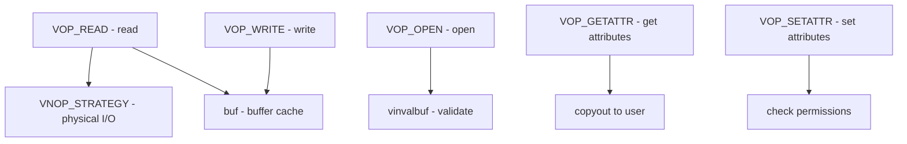

# Component: vfs_vnops.c

**Path:** `sys/kern/vfs_vnops.c`
**Type:** File
**Maps to:** `.discovery/sys/kern/vfs_vnops.md`

## Purpose

Vnode operations - implements generic vnode operations used by file systems. Handles read, write, open, close, and other file-level operations at the VFS layer.

## Structure

## Key Functions

| Function | Purpose | Signature |
|----------|---------|-----------|
| `vn_open` | Open file | `int vn_open(struct thread *td, ...)` |
| `vn_close` | Close file | `void vn_close(struct vnode *vp, int flags, ...)` |
| `vn_rdwr` | Read/write | `int vn_rdwr(enum uio_rw rw, struct vnode *vp, ...)` |
| `vn_lock` | Lock vnode | `int vn_lock(struct vnode *vp, int flags)` |
| `vn_unlock` | Unlock vnode | `void vn_unlock(struct vnode *vp)` |
| `vn_cycle` | Handle mount cycle | `int vn_cycle(struct nameidata *ndp, ...)` |
| `vn_extattr` | Extended attributes | `int vn_extattr(struct vnode *vp, ...)` |

## VOP Operations (vnode operations)

| Operation | Purpose |
|-----------|---------|
| `VOP_READ` | Read from file |
| `VOP_WRITE` | Write to file |
| `VOP_OPEN` | Open vnode |
| `VOP_CLOSE` | Close vnode |
| `VOP_GETATTR` | Get attributes |
| `VOP_SETATTR` | Set attributes |
| `VOP_ACCESS` | Check access |
| `VOP_LOOKUP` | Lookup name |
| `VOP_CREATE` | Create file |
| `VOP_REMOVE` | Remove file |
| `VOP_RENAME` | Rename file |
| `VOP_MKDIR` | Create directory |
| `VOP_RMDIR` | Remove directory |
| `VOP_READDIR` | Read directory |
| `VOP_READLINK` | Read symlink |
| `VOP_SYMLINK` | Create symlink |

## Vnode Lock Flags

| Flag | Description |
|------|-------------|
| `LK_EXCLUSIVE` | Exclusive lock |
| `LK_SHARED` | Shared lock |
| `LK_RETRY` | Retry on failure |

## Includes

- `sys/vnode.h` - Vnode definitions
- `sys/buf.h` - Buffer cache
- `sys/uio.h` - I/O vector

## Depends On

- `vfs_subr.c` for VFS utilities
- `vfs_bio.c` for buffer cache