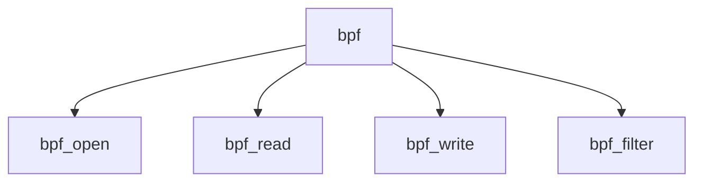

# Component: bpf.c

**Path:** `sys/net/bpf.c`
**Type:** File
**Maps to:** `.discovery/sys/net/bpf.md`

## Purpose

Berkeley Packet Filter - packet capture and filtering.

## Structure

## Key Functions

| Function | Purpose | Signature |
|----------|---------|-----------|
| `bpf_open` | Open | `int bpf_open(struct cdev *dev, int mode, int type, struct thread *td)` |
| `bpf_read` | Read | `int bpf_read(struct cdev *dev, struct uio *uio, int flags)` |
| `bpf_write` | Write | `int bpf_write(struct cdev *dev, struct uio *uio, int flags)` |
| `bpf_filter` | Filter | `u_int bpf_filter(struct bpf_insn *ins, struct mbuf *m, u_int wirelen, u_int buflen)` |

## BPF Operations

| Op | Description |
|----|-------------|
| `BIOCSETF` | Set filter |
| `BIOCFLUSH` | Flush |
| `BIOCGRTIMEOUT` | Get timeout |

## Use Cases

| Use | Description |
|-----|-------------|
| `packet` | Packet capture |
| `filter` | BPF filtering |

## Includes

- `net/bpf.h` - BPF definitions