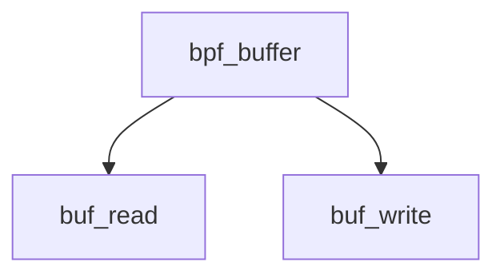

# Component: bpf_buffer.c

**Path:** `sys/net/bpf_buffer.c`
**Type:** File
**Maps to:** `.discovery/sys/net/bpf_buffer.md`

## Purpose

BPF buffer - buffer management for BPF.

## Structure

## Key Functions

| Function | Purpose | Signature |
|----------|---------|-----------|
| `buf_read` | Read | `int buf_read(int fd, ...)` |
| `buf_write` | Write | `int buf_write(int fd, ...)` |

## Use Cases

| Use | Description |
|-----|-------------|
| `bpf` | Berkeley Packet Filter |
| `buffer` | Buffer management |

## Includes

- `net/bpf.h` - BPF definitions