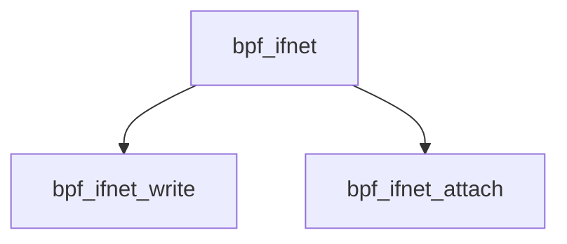

# Component: bpf_ifnet.c

**Path:** `sys/net/bpf_ifnet.c`
**Type:** File
**Maps to:** `.discovery/sys/net/bpf_ifnet.md`

## Purpose

BPF interface - BPF attachment to network interfaces.

## Structure

## Key Functions

| Function | Purpose | Signature |
|----------|---------|-----------|
| `bpf_ifnet_write` | Write | `int bpf_ifnet_write(void *arg, struct mbuf *m, ...)` |
| `bpf_ifnet_attach` | Attach | `int bpf_ifnet_attach(struct ifnet *ifp)` |

## Use Cases

| Use | Description |
|-----|-------------|
| `bpf` | Berkeley Packet Filter |
| `interface` | Interface attachment |

## Includes

- `net/bpf.h` - BPF definitions