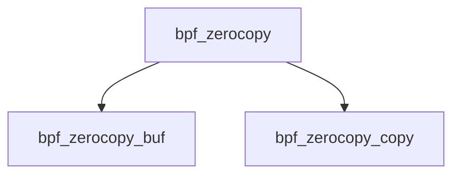

# Component: bpf_zerocopy.c

**Path:** `sys/net/bpf_zerocopy.c`
**Type:** File
**Maps to:** `.discovery/sys/net/bpf_zerocopy.md`

## Purpose

BPF zerocopy - zero-copy buffer scheme for BPF.

## Structure

## Key Functions

| Function | Purpose | Signature |
|----------|---------|-----------|
| `bpf_zerocopy_buf` | Buffer | `int bpf_zerocopy_buf(struct bpf_if *bp, ...)` |
| `bpf_zerocopy_copy` | Copy | `int bpf_zerocopy_copy(struct bpf_if *bp, ...)` |

## Use Cases

| Use | Description |
|-----|-------------|
| `bpf` | Berkeley Packet Filter |
| `zerocopy` | Zero-copy |

## Includes

- `net/bpf_zerocopy.h` - Zerocopy definitions