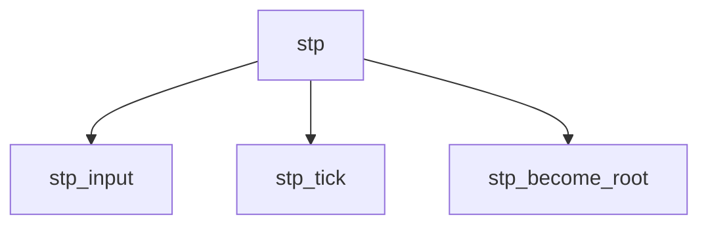

# Component: bridgestp.c

**Path:** `sys/net/bridgestp.c`
**Type:** File
**Maps to:** `.discovery/sys/net/bridgestp.md`

## Purpose

Spanning Tree Protocol - IEEE 802.1D spanning tree for bridges.

## Structure

## Key Functions

| Function | Purpose | Signature |
|----------|---------|-----------|
| `stp_input` | Input | `void stp_input(struct ifnet *ifp, struct mbuf *m)` |
| `stp_tick` | Tick | `void stp_tick(struct bridge_softc *sc)` |
| `stp_become_root` | Become root | `void stp_become_root(struct bridge_softc *sc)` |

## STP States

| State | Description |
|-------|-------------|
| `BPDU_BLOCK` | Block |
| `BPDU_LISTEN` | Listen |
| `BPDU_LEARN` | Learn |
| `BPDU_FORWARD` | Forward |

## Use Cases

| Use | Description |
|-----|-------------|
| `stp` | Spanning tree |
| `bridge` | Bridge loop prevention |

## Includes

- `net/if_bridgevar.h` - Bridge STP definitions